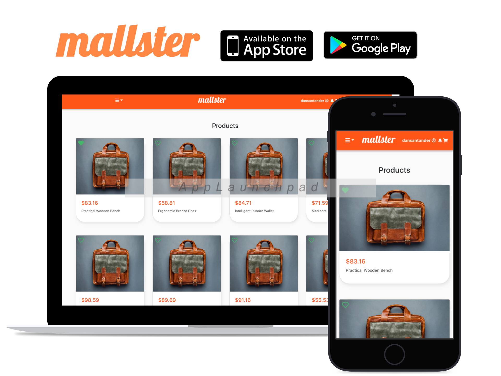

# MALLSTER
>  A browser based mobile application that gathers all of the most common mall's brands for you to buy directly from your favorite shops.



## Table of Contents

* [Features](#features)
* [Live Demo](#demo)
* [Installation](#installation)
* [Built With](#built-with)
* [Contributing](#contributing)
* [Acknowledgments](#acknowledgments)
* [Authors](#author)
* [License](#license)

## Features

- A user can get registered within the app.
- A user can sign in with his already registered email address.
- A list of products is displayed when successfully signed in.
- Every product can display more details when clicked.
- A user can add a product to his/her favorites by clicking the little green heart <br>
at the top of a product.
- A user can acces a list of his/her favorite products.
- A user can log out of the application.

## Demo

  - https://eloquent-montalcini-bccf89.netlify.app

## Installation

You can get a local copy of the repository please run the following commands on your terminal:
```
$ cd <folder>
$ git clone git@github.com:dansantander/moviedb.git
$ npm install
$ npm start
```

## Built With

- React
- Redux
- React-DOM
- React-Create-App
- React Testing Library
- JavaScript
- Bootstrap

## Contributing

Contributions, issues and feature requests are welcome!

You can do it on [issues page](issues/).

## Acknowledgments

Special thanks to code reviewers.

## Show your support

Give a ⭐️ if you like this project!

## Authors

👤 **Daniel Santander**

- Github: [@dansantander](https://github.com/dansantander)
- Linkedin: [Daniel Santander](https://www.linkedin.com/in/daniel-santander)
- Twitter: [@dansantandr](https://twitter.com/dansantandr)

## License

<strong>Creative Commons 2020</strong>